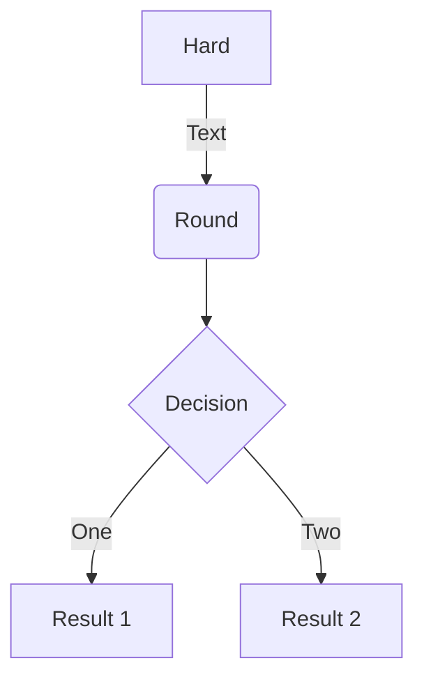

### SuperFences

Inline code `is like this`.

Highlight

```python hl_lines="1 3"
# This line is emphasized
# This line isn't
# This line is emphasized
```

No language

```
# Line 1
# Line 2
```

Text

```text
# Line 1
# Line 2
```

Python

```python
# Line 1
def line2():
    print("string", 3)
    return
```

Python without line numbering (1)

```python linenums="0"
# Line 1
def line2():
    print("string", 3)
    return
```

Python without line numbering (2)

```{.python .no-line-nums}
# Line 1
def line2():
    print("string", 3)
    return
```
Mermaid



```markdeep

*************************************************************************************************
*.-------------------.                           ^                      .---.                   *
*|    A Box          |__.--.__    __.-->         |                      |   |                   *
*|                   |        '--'               v                      |   |                   *
*'-------------------'                                                  |   |                   *
*                       Round                                       *---(-. |                   *
*  .-----------------.  .-------.    .----------.         .-------.     | | |                   *
* |   Mixed Rounded  | |         |  / Diagonals  \        |   |   |     | | |                   *
* | & Square Corners |  '--. .--'  /              \       |---+---|     '-)-'       .--------.  *
* '--+------------+-'  .--. |     '-------+--------'      |   |   |       |        / Search /   *
*    |            |   |    | '---.        |               '-------'       |       '-+------'    *
*    |<---------->|   |    |      |       v                Interior                 |     ^     *
*    '           <---'      '----'   .-----------.              ---.     .---       v     |     *
* .------------------.  Diag line    | .-------. +---.              \   /           .     |     *
* |   if (a > b)     +---.      .--->| |       | |    | Curved line  \ /           / \    |     *
* |   obj->fcn()     |    \    /     | '-------' |<--'                +           /   \   |     *
* '------------------'     '--'      '--+--------'      .--. .--.     |  .-.     +Done?+-'      *
*    .---+-----.                        |   ^           |\ | | /|  .--+ |   |     \   /         *
*    |   |     | Join                   |   | Curved    | \| |/ | |    \    |      \ /          *
*    |   |     +---->  |                 '-'  Vertical  '--' '--'  '--  '--'        +  .---.    *
*    '---+-----'       |                                                            |  | 3 |    *
*                      v                             not:line    'quotes'        .-'   '---'    *
*                  .---+--------.            /            A || B   *bold*       |        ^      *
*                 |   Not a dot  |      <---+---<--    A dash--is not a line    v        |      *
*                  '---------+--'          /           Nor/is this.            ---              *
*************************************************************************************************
[Figure [diagram]: Diagrams can also have captions]


```


### Asides

::: spoiler
    This is *true* markdown text.
    
    Markdown allows you to be lazy and only put the `>` before the first
    line of a hard-wrapped paragraph:
    
>     This is a blockquote with two paragraphs. Lorem ipsum dolor sit amet,
    consectetuer adipiscing elit. Aliquam hendrerit mi posuere lectus.
    Vestibulum enim wisi, viverra nec, fringilla in, laoreet vitae, risus.
    
    Spoilers will happily nest arbitrarily:
    ::: spoiler
        See?

::: spoiler Pesterlog
    This is *true* markdown text.

TOC inside a spoiler:

::: spoiler TOC
    [TOC]

### Footnotes

Footnotes[^1] have a label[^@#$%] and the footnote's content.

[^1]: This is a footnote content.
[^@#$%]: A footnote on the label: "@#$%".

A footnote with a complicated definition.[^2]

[^2]:
    The first paragraph of the definition.

    Paragraph two of the definition.

    > A blockquote with
    > multiple lines.

        a code block

    A final paragraph.

    The only problem is that the actual gameplay feels... janky? Just unpolished. It's generally tricky to move where you want to go, the buttons have odd bounding boxes, and it just doesn't *feel* great to play, from a programming standpoint. There are lots of little janky programming things, like the menu with a "Save Game" option but no "Load Game" option, and the cursor not indicating whether or not things are interactable at points. There's a single snake minigame (the Nokia one, not a cool serpent pal) that's repeated twice and feels like a my-first-unity tutorial project, and really nothing else. It really feels like the actual programming of the game was rushed and sloppy.

This is a second point, but it has the same footnote. Weird![^2]
